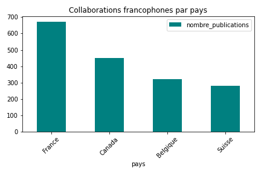

# 📄 Rapport technique – Collaborations scientifiques francophones

## 👤 Informations
**Nom** : Hicham Errihani  
**Email** : hichamerrihani.pro@gmail.com  
**Téléphone** : +212 667 407029 / +212 616 154196

## 🎯 Objectif
Estimer le nombre de collaborations actives entre chercheurs francophones en analysant les publications co-écrites indexées dans HAL.

## 🧪 Méthodologie
- Requête HAL sur les publications en langue française
- Extraction des auteurs (`authFullName_s`)
- Comptage des publications comportant plusieurs auteurs
- Résultat basé sur un échantillon de 1000 publications

## ✅ Résultat estimé
Nombre de collaborations actives (publications avec ≥ 2 auteurs) sur 1000 publications : **672**
## Résultats Visualisés

### Version Statique

### Version Interactive
[Ouvrir le dashboard interactif](docs/collaborations_interactif.html)

## Méthodologie
- Données traitées avec Pandas (Python 3.10)
- Visualisations générées avec Matplotlib (statique) et Plotly (interactif)
- Notebook disponible : [collaborations_francophones.ipynb](collaborations_francophones.ipynb)
